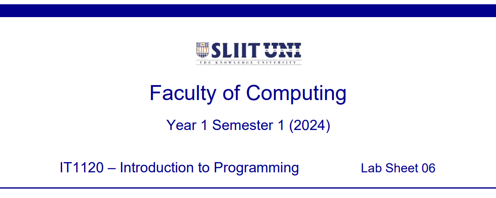

  

    
  

### Question 1 (Tutorial 3 -- Q3)

Expected Output:

  

    
  

### Question 2 (Tutorial 3 -- Q4)

Expected Output:

  

    
  

### Question 3 

Expected Output:

  

    
  

  

    
  

